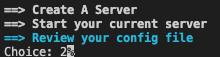

# go-arrow-menu

Go arrow menu.

Install:

```txt
go get github.com/glaukiol1/go-arrow-menu
```

In-code usage:

```go
func _main(choice int) {
	fmt.Print("Choice: " + fmt.Sprint(choice))
}

func main() {
	options := []string{
		"Create A Server",
		"Start your current server",
		"Review your config file",
	}
	menu.StartMenu(options, _main)
}
```


An exmaple menu:



Interact with the menu using `up` `down` arrow keys and `enter` for confirming.
